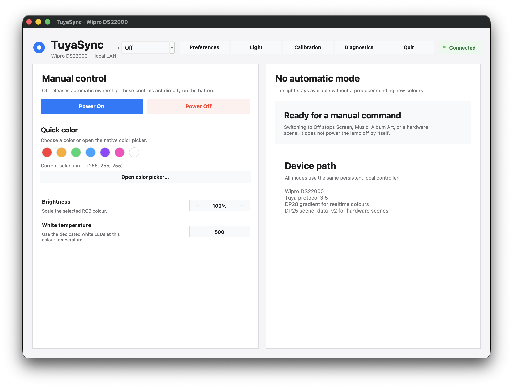
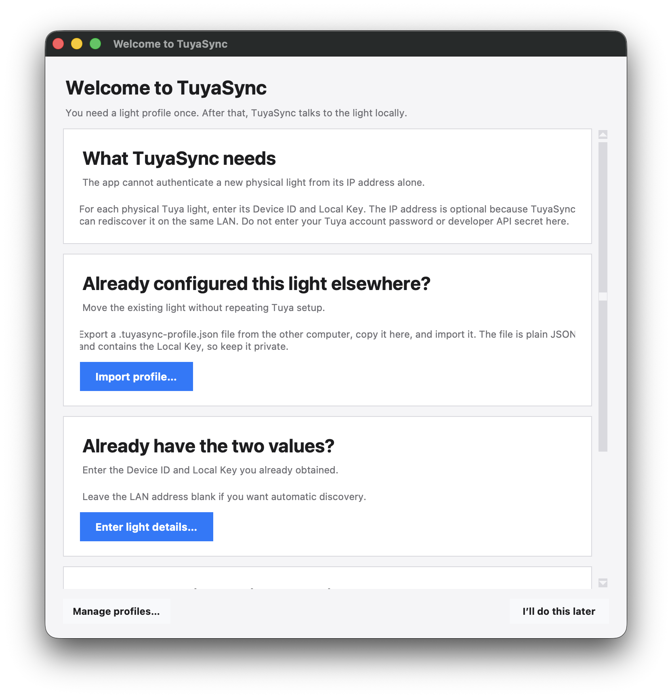

# TuyaSync

TuyaSync is a standalone desktop controller for a Wipro Next Smart Wi‑Fi 20W
CCT+RGB LED Batten (DS22000). It reads your display, system audio, or local
Spotify desktop metadata and drives the light over the local network.

The app is intentionally local. After a light profile has been created,
TuyaSync talks directly to the light with TinyTuya; it does not use Tuya cloud
control, OAuth, Spotify Web API credentials, or a paid service at runtime.

## Download and install

Download the latest release for your computer from the
[Releases](../../releases) page.

- macOS: download `TuyaSync-macOS.zip`, unzip it, and open `TuyaSync.app`.
- Windows: download `TuyaSync-windows.zip`, unzip it, and run `TuyaSync.exe`.

The release bundles the Python runtime and application dependencies. Python does
not need to be installed on the target computer.

The first launch may ask for normal platform permissions:

- macOS: allow screen recording and audio capture when requested. If macOS
  shows a security warning for the downloaded app, use Finder → Open once.
- Windows: allow TuyaSync through Windows Firewall so it can discover and reach
  the light on the local network.

## First run

TuyaSync starts in `Off`. On a new installation it opens a short light setup
guide. You can either import an existing profile or enter a new light's
credentials.

For a new physical light, pair it in Smart Life or Tuya Smart first, then use
TinyTuya's one-time setup wizard to obtain that light's Device ID and Local Key.
The official instructions are in the
[TinyTuya setup guide](https://github.com/jasonacox/tinytuya#setup-wizard---getting-local-keys).
TuyaSync itself does not need your Tuya account after those two light-specific
values are available.

The LAN address is optional. Leaving it blank lets TuyaSync rediscover the
light when the router assigns it a different address.

## Moving a light to another computer

The profile belongs to the physical light, not to the computer. In **Light
profiles**, choose **Export**, copy the visible `.tuyasync-profile.json` file to
the other computer, then choose **Import** there. This avoids repeating the
Tuya developer-console setup for the same light.

The profile is deliberately plain JSON and contains the Local Key. It is easy
to inspect and move, but anyone who obtains it should be treated as able to
control that light on its local network. Keep it private and never commit it.
The file does not make the light controllable from anywhere on the internet;
the computer still needs local-network reachability, such as the same LAN or a
private VPN.

## Features

- **Screen** — ambient color from the selected display, with saturated color
  analysis, black-bar and subtitle/static-UI handling, smoothing, deadband,
  adaptive timing, brightness shaping, and optional dedicated-white routing.
- **Music** — local system-audio analysis with palette mapping and adaptive
  normalization.
- **Album Art** — reads local Spotify desktop metadata and artwork; it does not
  sign in to Spotify's Web API.
- **Scenes** — sends hardware-executed scene payloads to the light, including
  built-in and custom scenes.
- **Manual controls** — power, color, white temperature, brightness, and
  scene controls remain available independently of automatic modes.
- **Exclusive mode ownership** — only one of `Off`, `Screen`, `Music`, `Album
  Art`, or `Scenes` can control the light automatically at a time.
- **Resilient LAN control** — persistent TinyTuya connection, serialized
  latest-value-wins output, reconnect/backoff, and automatic IP rediscovery.
- **Menu bar / system tray** — quick mode and power controls while the settings
  window is hidden.
- **Cross-platform packaging** — native macOS app and Windows executable built
  separately for each operating system.





## Build from source

The physically tested development environment is Apple Silicon macOS. Windows
packaging is performed by the repository's GitHub Actions workflow; Windows
audio and media-session behavior still needs physical testing on a Windows
machine.

```text
python -m venv .venv
.venv/bin/python -m pip install -r requirements.txt
.venv/bin/python -m screensync.ui
```

Build a standalone application on the matching operating system:

```text
python -m pip install -r requirements.txt pyinstaller
python -m PyInstaller --clean --noconfirm screensync.spec
```

The output is `dist/TuyaSync.app` on macOS or `dist/TuyaSync.exe` on Windows.
A macOS build cannot be used as a Windows build.

## Development checks

```text
PYTHONPATH=. python -m unittest \
  screensync.tests.test_ui_swatches \
  screensync.tests.test_tuya_resilience \
  screensync.tests.test_light_profiles \
  screensync.tests.test_scenes \
  screensync.tests.test_album_art \
  screensync.tests.test_music \
  screensync.tests.test_light_service \
  screensync.tests.test_mode_manager \
  screensync.tests.test_ambient \
  screensync.tests.test_perceptual
python -m compileall -q screensync
```

## Project scope

TuyaSync is intentionally limited to the Wipro DS22000 local-LAN workflow.
Legacy MQTT, MagicHome, Zigbee, cloud-control, and unrelated experiment code
are not part of this repository.
